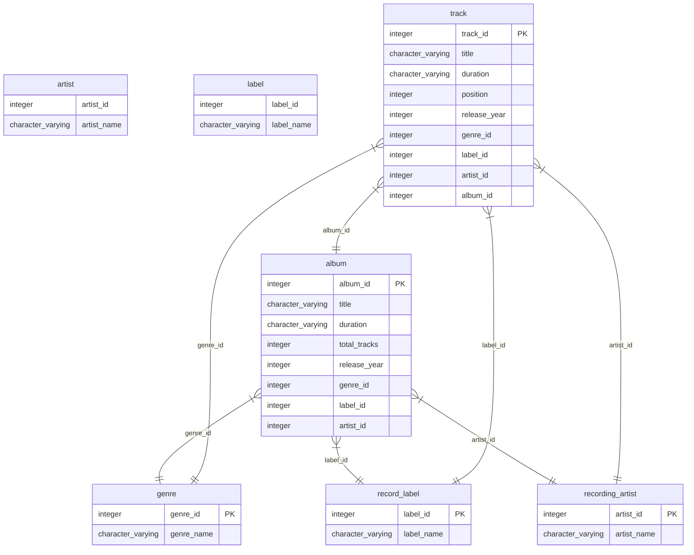

# Database Schema Wiki

Welcome to the database schema wiki. This wiki documents the tables, columns, and relationships in the database.

## Table of Contents

### Schema: `music`

- [artist](artist.md)
- [label](label.md)
- [genre](genre.md)
- [album](album.md)
- [record_label](record_label.md)
- [recording_artist](recording_artist.md)
- [track](track.md)

## Entity Relationship Diagram (ERD)

